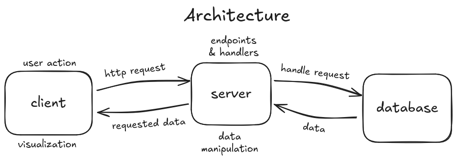
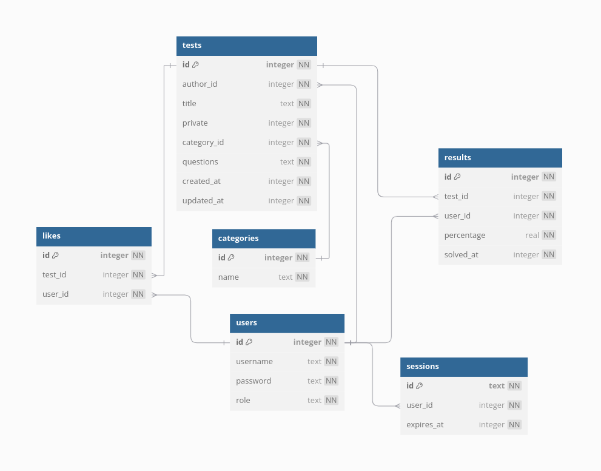

# StddyBddy: Уеб базирана платформа за съвместно учене 📚✨

StddyBddy е уеб приложение, създадено за съвместно учене чрез споделяне и решаване на учебни тестове. Разработено като дипломен проект за професионална квалификация „Системен програмист“ в СПГЕ „Джон Атанасов“.

## Общ Преглед

Платформата цели да революционизира традиционния модел на обучение, като предоставя пространство, където потребителите (ученици, студенти, учители) могат да създават, споделят и решават тестове съвместно. Това децентрализира достъпа до качествени учебни материали и осигурява незабавна обратна връзка за улесняване на проследяването на напредъка. StddyBddy действа като фокусиран „дигитален приятел за учене“ (study buddy), достъпен навсякъде.

## ✨ Функционалности

*   **Потребителска Автентикация:** Сигурна система за регистрация и вход.
*   **Потребителски Роли:** Различни функционалности за обикновени Потребители и Администратори.
*   **Управление на Тестове (CRUD):** Потребителите могат да създават, четат, актуализират и изтриват собствените си тестове. Администраторите имат пълен контрол над всички тестове.
*   **Поверителност на Тестовете:** Тестовете могат да бъдат маркирани като публични (достъпни за всички) или частни (достъпни само за автора и администраторите).
*   **Решаване на Тестове:** Интерактивен интерфейс за решаване на тестове.
*   **Проследяване на Резултати:** Потребителите могат да преглеждат резултатите си от решените тестове, за да следят напредъка си.
*   **Категории на Тестове:** Организиране на тестовете по предмет или тема.
*   **Харесване на Тестове:** Потребителите могат да „харесват“ тестове, които намират за полезни.
*   **Търсене и Филтриране:** Цялостна функционалност за търсене за намиране на тестове по заглавие, потребителско име на автора или категория.
*   **Администраторско Табло:** Администраторите могат да управляват потребители (CRUD, принудително излизане) и всички тестове (CRUD, промяна на автор, промяна на поверителност).
*   **Адаптивен Дизайн:** Интерфейс, удобен за мобилни устройства, за учене в движение.

## 🛠️ Технологичен Стек

*   **Frontend (Клиентска част):**
    *   React 19
    *   TypeScript
    *   Vite
    *   Tailwind CSS
    *   shadcn/ui
    *   Lucide Icons
    *   React Router
*   **Backend (Сървърна част):**
    *   Bun
    *   Express.js
    *   TypeScript
    *   Drizzle ORM
    *   Lucia Auth
    *   Pino
*   **База Данни:**
    *   SQLite (За разработка)
    *   PostgreSQL (Препоръчва се за бъдещо мащабиране)

## 🏛️ Архитектура

Приложението следва стандартна трислойна архитектура:

1.  **Клиент (Frontend):** Single Page Application (SPA), изградено с React. Обработва рендирането на потребителския интерфейс, взаимодействията на потребителите и комуникира с бекенда чрез REST API извиквания. Управлението на състоянието се извършва в рамките на React компонентите. Рутирането се управлява от React Router. Стилизирането се осъществява чрез Tailwind CSS и компоненти от shadcn/ui.
2.  **Сървър (Backend):** REST API сървър, изграден с Express.js, работещ под Bun runtime. Обработва бизнес логиката, валидацията на данни (използвайки Zod), автентикацията/авторизацията на потребителите (базирана на сесии) и взаимодейства с базата данни чрез Drizzle ORM.
3.  **База Данни:** Релационна база данни (първоначално SQLite) съхранява всички данни на приложението, включително потребители, тестове, сесии, резултати, категории и харесвания. Drizzle ORM предоставя типово-безопасен интерфейс за операции с базата данни.



## 💾 Схема на Базата Данни

Базата данни се състои от следните основни таблици:

*   `users`: Съхранява потребителска информация (id, username, хеширана парола, role).
*   `sessions`: Управлява потребителските сесии за автентикация (id, user\_id, expires\_at).
*   `tests`: Централна таблица за тестове (id, author\_id, title, флаг за поверителност, category\_id, questions JSON, времеви печати).
*   `categories`: Съхранява категориите на тестовете (id, name).
*   `results`: Проследява резултатите на потребителите от тестовете (id, test\_id, user\_id, percentage, solved\_at).
*   `likes`: Съхранява харесванията на тестовете от потребителите (id, test\_id, user\_id).



## 📁 Структура на Проекта

```
stddybddy/
├── backend/         # Backend код (Express, Drizzle, TypeScript)
├── frontend/        # Frontend код (React, TypeScript, Vite)
├── shared/          # Споделен код (типове, схеми за валидация)
└── docs/            # Документация, диаграми, изображения
```

## 🚀 Първи Стъпки

### Изисквания

*   Инсталиран Bun (`curl -fsSL https://bun.sh/install | bash`)

### Настройка

1.  **Клониране на хранилището:**
    ```bash
    git clone <your-repository-url>
    cd stddybddy # Влезте в основната директория на проекта
    ```

2.  **Инсталиране на Зависимости:**
    ```bash
    # Инсталиране на backend зависимости
    cd backend
    bun install

    # Инсталиране на frontend зависимости
    cd ../frontend
    bun install

    # Инсталиране на shared зависимости
    cd ../shared
    bun install
    cd ..
    ```

3.  **Backend Конфигурация:**
    *   Влезте в директория `backend`
    *   Създайте `.env` файл
        ```env
        # .env в директория backend
        DB_FILE_NAME=./stddybuddy.db # Или предпочитан път/име за SQLite файла
        PORT=1337 # Опционално, по подразбиране е 1337
        ```

4.  **Настройка на Базата Данни:**
    *   Уверете се, че сте в директория `backend`.
    *   Прилагане на схемата на базата данни:
        ```bash
        bunx drizzle-kit push
        ```
    *   (Опционално) Попълване на базата данни с начални данни:
        ```bash
        bun run src/db/seed.ts
        ```

## 🏃 Употреба

1.  **Стартиране на Backend Сървъра:**
    ```bash
    cd backend
    bun dev
    ```
    Backend сървърът обикновено ще стартира на `http://localhost:1337`.

2.  **Стартиране на Frontend Сървъра за Разработка:**
    ```bash
    cd frontend
    bun dev
    ```
    Frontend приложението ще бъде достъпно на `http://localhost:5173` (или друг порт, ако 5173 е зает).

3.  Отворете браузъра си и отидете на `http://localhost:5173`.
